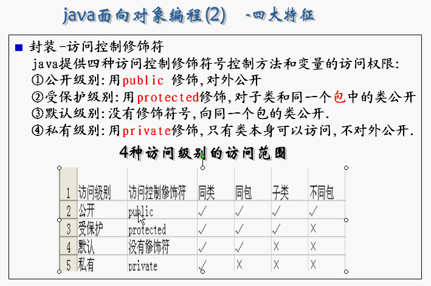

# java se学习知识点整理

---


## [JAVA常用的4种排序方法实现代码](src/cn/tekin/utils/sort)


- [java 快速排序法实现](src/cn/tekin/utils/sort/QuickSort.java)

- [java 二分查找法实现](src/cn/tekin/demo/TwoSplitFindDemo.java)


## JAVA学习资料

- [JAVA基础知识.pdf](docs/JAVA基础知识.pdf)

- [Java 面试知识点解析.pdf](docs/Java面试知识点解析.pdf)

- [JAVA中文乱码.doc](docs/JAVA中文乱码.doc)

- [常见数据结构.docx](docs/常见数据结构.docx)

- [常见算法基础题思路简析.doc](docs/常见算法基础题思路简析.doc)

- [几种常见排序算法.docx](docs/几种常见排序算法.docx)

- JAVA 修饰符




# 练习Demo

- [JAVA算术运算，移位运算DEMO和详细运算过程讲解](src/Operation.java)

- [JAVA实现的雇员管理小程序](src/AssembleDemo2.java)


# 常用集合框架
ArrayList
HashMap
HashTable
LinkedList
Vector
Stack
Iterator

List结构集合类
ArrayList， LinkedList, Vector, Stack

Map结构集合类
HashMap
HashTable

Set结构集合类
HashSet
TreeSet

Queue队列结构的集合类
Queue接口

 
## JAVA中 == 比较的是引用地址是否相等，  equals() 比较的是值是否相等

如
```java

    String a=new String("abc");
    String b=new String("abc");
    if(a==b) {
        System.out.println("ok!");
    }else{
        System.out.println(" fail ");
    }
    
//结果  fail

if(a.equals(b)) System.out.println("ok!");
    //结果OK
    
```


[Tekin](http://tekin.yunnan.ws)